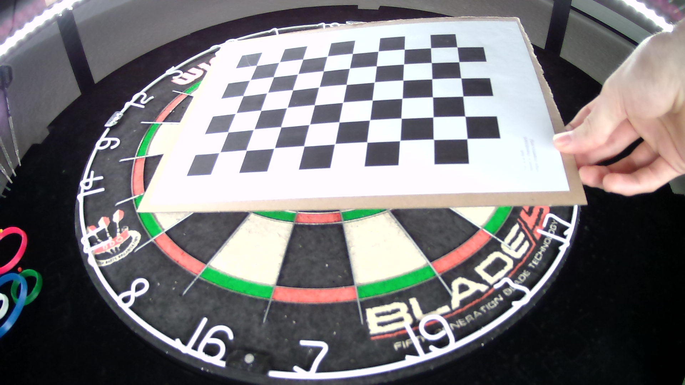
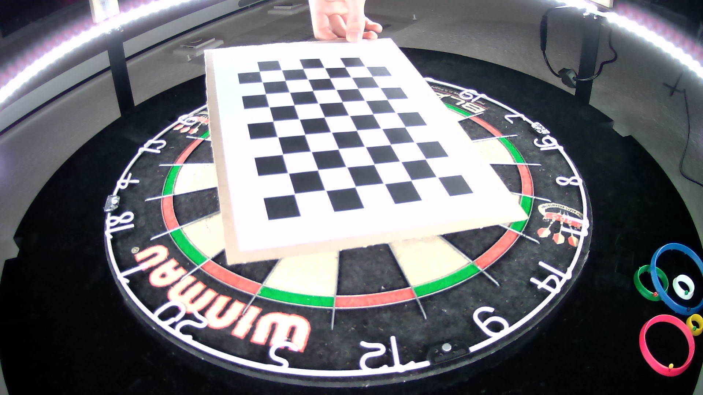
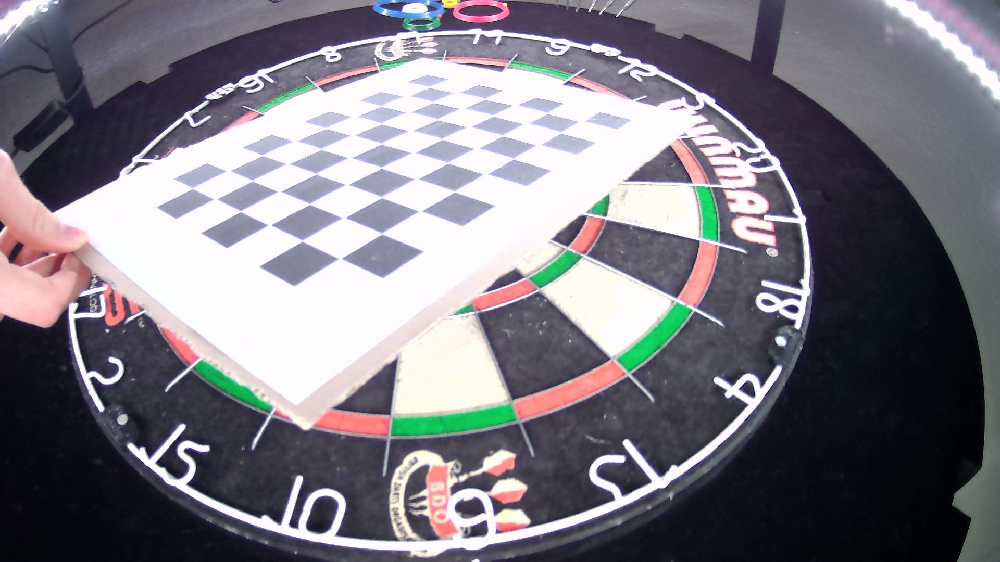

This is a tool to generate a distortion.json which can be used to remove the distortion in Autodarts. But here sadly you will need a computer with linux installed and a desktop environment.

I will check if I can also run it on Windows later and try to build a Raspberry Pi edition. We will work on a solution where you can use this tool on a desctopless device like the Pi.

### Requirements and installation

First you'll need a chess pattern (you can print it) which you need to glue as flat as you can on something. It really needs to be flat because if not your calibration won't work well.

I used the following pattern https://docs.opencv.org/4.5.2/pattern.png

The tool was developed in Python which means we need to install Python if it's not already installed. Because this program opens up some windows where you can see what you're capturing you need a desktop linux device. This could be Ubuntu desktop or Raspberry Pi with a desktop installed.

To check if Python is installed you can use the command

    python3 -V

If you see the output similar to this you are good

    Python 3.8.10

Not that at least the Python version 3.5.x is required. The most systems already got Python installed if not you need to install it. Here is a good guide for Ubuntu https://docs.python-guide.org/starting/install3/linux/.
And here is a good guide for Raspberry https://projects.raspberrypi.org/en/projects/generic-python-install-python3#linux

What you also need is git installed. You can check it by the following command.

    git --version

If the output is like the following you are good

    git version 2.25.1

If not you need to install it by the package manager. For Ubuntu and Raspberry with the following command

    sudo apt-get update

We need to install the package manager for Python

    sudo apt-get install python3-pip

After that we need to install the tqdm library which are needed

    pip3 install tqdm opencv-python

Followed by the command

    sudo apt-get install git-all

Check it again with 

    git --version

If the output should be like the mentioned above.

Last but not least you need to clone the tool from Github by the command

    git clone https://github.com/autodarts/cam-calibration.git

Change into the downloaded folder

    cd cam-calibration

## How to use

Now you will need your camera(s) which you want to calibrate connected. You can calibrate three cams at once even on your dartboard.
I glued the chess pattern to a cardboard so that it's possible to hold it in front of my cameras on the dartboard. Of course you can glue it on your floor or wherever you want.

As soon as you start the tool, the amount of windows will open like the amount of calibrating cams. Once they are open the tool will take a picture about every second from every cam and stored in a folder called calibrationImages with subfolders named by the deviceIds. The more images you will create the more accurate you distortion.json will be. I did it with around 50 pictures.
When the images are made try to get the chessboard on whole on the camera picture. You can see that in the windows which are visible and get as many angles you can. Place it flat to the board, turn it, lift it and so on. Here are some example pictures.

Once you set up all that stuff you can run the tool. Therefore, the tool provides different options

    python3 main.py generate -camIds 0 2 3 -fps 30 -w 800 -h 600

This command is taking pictures every 5 seconds with 30 fps and a resolution of 800x600. You can change the resolution by changing the values -w and -h.
You also need to check which camera is connected and which cameraId it has. You can do that with the already known command

    v4l2-ctl --list-devices
    
Replace the numbers behind -camIds with the ids you have. You also can set one or two cams which than creates the distortion.json for just one or two cams.
If you run the command now some frames should pop up depends on the camera amount you fired with the command. The tool starts to make pictures about every second and a green flashing rectangle pops up.
As soon as you are done you can stop the tool by pressing ESC or Ctrl + C in the commandline.

### Create distortion.json

You can than simply create the distortion.json with the command

    python3 main.py distortion -w 800 -h 600

Please make sure you're using the same resolution as you created the images. If not the distortion.json will be wrong and your calibration won't work.
When the tool is done a new file called distortion.json is placed in the folder. Copy it to your .autodarts config folder and you are done.

    mv distortion.json ~/.autodarts

    
    