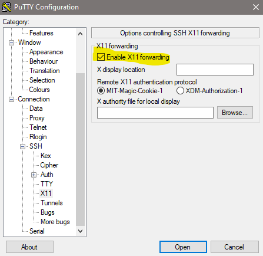

## HEADLESS installation

Be sure you followed the installation guide from [HERE](README.md) and have python, opencv, git, pip and v4l2-ctl up and running.

To use the calibration tool without a Dektop environment we use Xming with X11 forwarding.

Download and install Xming: https://sourceforge.net/projects/xming/

To conenct via SSH we use Putty: https://www.putty.org/

Conenct to your headless linux machine via Putty and check the option "Enable X11 forwarding" under Connection / SSH / X11 before you click open

If you login to your linux machine directly with user root you can check if everything works by execute the following commands. If you login via a non-root user (eg. root login disabled) or have to switch to a root user after login to get full permissions , follow the steps for NON-ROOT userser down below

    echo $DISPLAY

If the output looks something like this, everything should be good

    localhost:10.0 

You can now test the X11 forwarding by executing 

    xlock

If missing you can find xlock in following package (ubuntu/ Raspberry)

    sudo apt-get install x11-apps

If verything works correct a small window with a clock should appear on your desktop.
You could now following the "How To Use" Section from the basic isntallation guide [HERE](README.md)

## NON ROOT User

Be sure you installed Xming and use Putty with X11 forwarding enabeld to conenct to yout linux machine as discribed above.

After login with your non-root user first check if X11 forwarding was enabeld correctly 

    echo $DISPLAY

If the output looks something like this, everything should be good

    localhost:10.0 

Now we need the X authorization entry

    xauth list $DISPLAY

the output should look somehting like this
    
    host/unix:10  MIT-MAGIC-COOKIE-1  742d024faeb3d29a15ff06f1b8c3b21e

Switch to your root user

    sudo su -

Add the xauth from above by typing "xauth add <output from above>". In this example:
Be sure you modify the part afer xauth add with the output from the xauth list command

    xauth add host/unix:10  MIT-MAGIC-COOKIE-1  742d024faeb3d29a15ff06f1b8c3b21e

Last thing we have to do is to export the DISPLAY environment variable
Important: Modify the part after DISPLAY= with the output from the echo $DISPLAY command from above

    export DISPLAY=localhost:10.0

You can now test the X11 forwarding by executing 

    xlock

If missing you can find xlock in following package (ubuntu/ Raspberry)

    sudo apt-get install x11-apps

If verything works correct a small window with a clock should appear on your desktop.
You could now following the "How To Use" Section from the basic isntallation guide [HERE](README.md)

## Possible Problems

Be sure your SSH daemon has X11 forwarding enabeld

Check the **/etc/ssh/sshd_config** file for the following entrys

    X11Forwarding yes
    X11DisplayOffset 10
    X11UseLocalhost yes

